# Goalzo Analytics A Distributed Football Transfer Market Analytics & Player Profiling

<p align="center">
  
</p>

---


## 📋 Table of Contents

- [Project Overview](#-project-overview)
- [Dataset](#-dataset)
- [Tech Stack](#-tech-stack)
- [Project Pipeline](#-project-pipeline)
- [Exploratory Data Analysis (EDA)](#-exploratory-data-analysis-eda)
- [Business Questions & Descriptive Analysis](#-business-questions--descriptive-analysis)
- [Predictive Analysis – Transfer Window Prediction](#-predictive-analysis--transfer-window-prediction)
- [Descriptive Analysis – Player Categorization (K-Means)](#-descriptive-analysis--player-categorization-k-means)
- [Results Summary](#-results-summary)
- [Repository Structure](#-repository-structure)
- [Future Work](#-future-work)

---

## 🎯 Project Overview

Modern football clubs invest heavily in scouting and squad planning, yet transfer decisions remain uncertain because player value depends on many interacting factors — age, performance, injuries, league level, and transfer history. This project analyses **5.7M+ records** from the Comprehensive Football Dataset to answer business-oriented questions useful for clubs, scouts, analysts, and football business managers.

**Core questions we set out to answer:**
- What types of players share similar performance profiles?
- What transfer patterns occur between leagues, positions, and age groups?
- Which agents are most active with specific clubs?
- What nationality pairings are most common among teammates?
- What dual citizenships are most commonly held by the same player?
- Can we predict whether a player will transfer in the next transfer window?

---

## 📦 Dataset

**Source:** [Comprehensive Football Dataset – Kaggle](https://www.kaggle.com/datasets/xfkzujqjvx97n/football-datasets)

| Metric | Value |
|--------|-------|
| Players | 93,000+ worldwide |
| Clubs | 2,200+ across all major leagues |
| Total Records | 5.7M+ |
| Market Valuations | 902,000+ |
| Performance Stats | 1.9M+ |
| Transfer Histories | 1.2M+ |
| Injury Records | 144,000+ |
| National Team Appearances | 93,000+ |
| Teammate Relationships | 1.3M+ |

The schema is fully relational, structured across **10 CSV categories**:

**Player tables:** `player_profiles`, `player_performances`, `player_transfer_histories`, `player_market_values`, `player_injuries`, `player_national_team_performances`, `player_teammates_played_with`

**Team tables:** `team_details`, `team_competitions_seasons`, `parent_child_team_relations`

**Schema**:
<p align="center">
  
</p>

---

## 🛠 Tech Stack

- **PySpark** – Distributed data processing & RDD-based MapReduce
- **PySpark ML** – StandardScaler, distributed feature pipelines
- **scikit-learn** – KNN classifier (KNeighborsClassifier)
- **Pandas / NumPy** – Feature engineering & preprocessing
- **Seaborn / Matplotlib** – Heatmaps, pairplots, distribution plots
- **Python 3** – Core language

---

## 🗺 Project Pipeline

```
Raw Data (Kaggle CSV)
        │
        ▼
Exploratory Data Analysis (EDA)
  ├─ Missing value inspection per table
  ├─ Univariate & bivariate distributions
  └─ Correlation heatmaps & multivariate pairplots
        │
        ├──────────────────────────────────────┐
        ▼                                      ▼
Descriptive Analysis                  Predictive Analysis
  ├─ Transfer patterns (leagues,         ├─ Feature engineering
  │   positions, age groups)            │   (30 rolling-window features)
  ├─ Agent–club relationship mapping    ├─ Model 1: KNN via PySpark ML
  ├─ Dual citizenship analysis          └─ Model 2: KNN MapReduce (scratch)
  ├─ Nationality co-occurrence
  └─ K-Means Player Clustering
        │
        ▼
   Results & Evaluation
```

---

## 🔍 Exploratory Data Analysis (EDA)

A thorough EDA was conducted on each table. Key findings:

**Player Profiles** (92,671 records): Height normally distributed around 180 cm. Most common position: Defender – Centre-Back. ~72% of players carry EU citizenship. Several columns have >60% missing rate (e.g., `fourth_club_url`, `date_of_death`).

**Transfer History** (1,101,440 records): Dominant type is "Transfer" (~844K), followed by Loan. Transfer fees and market values at transfer are heavily right-skewed with a correlation of **0.67**.

**Player Performances** (1,878,719 records): `minutes_played` has ~62% missing rate; all other columns are fully populated. Goals and assists correlate strongly with appearances.

<p align="center">
  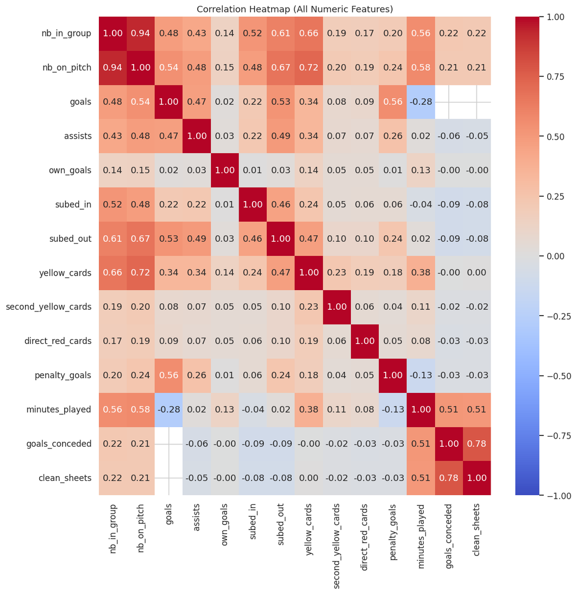
  <br><em>Correlation heatmap of all numeric features in the Player Performances table</em>
</p>

<p align="center">
  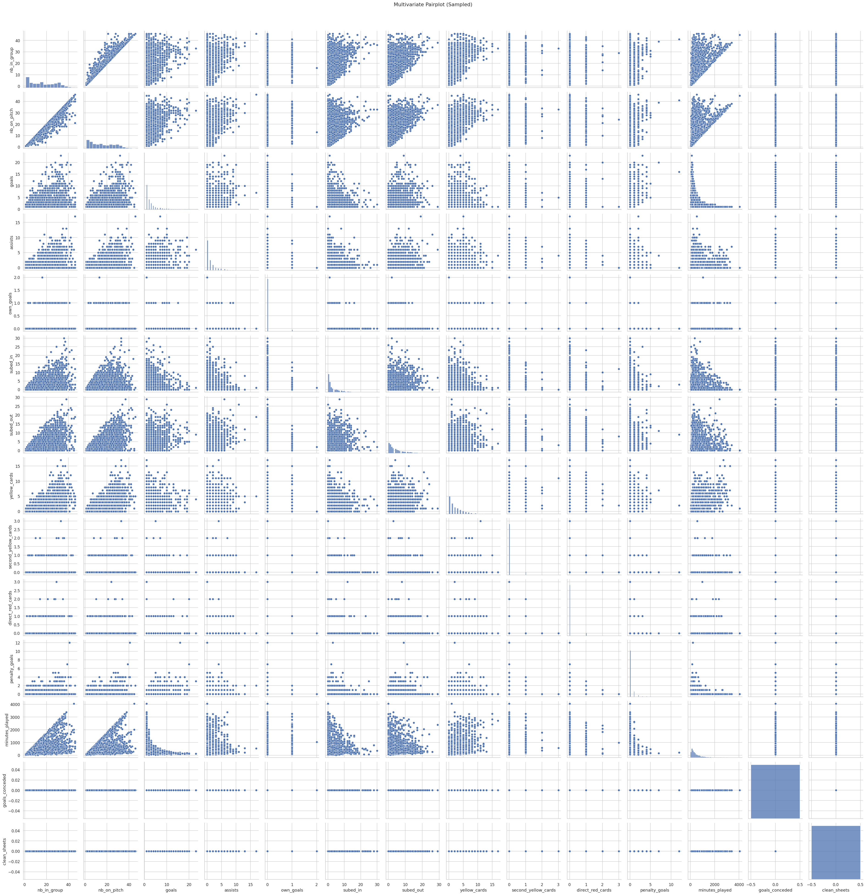
  <br><em>Multivariate pairplot (sampled) across all performance features</em>
</p>

> See [`EDA.ipynb`](EDA.ipynb) for the full analysis across all tables.

---

## 📊 Business Questions & Descriptive Analysis

### Q1 — What is the frequency of transfers between leagues?

Transfer heatmaps were generated across three time windows (last 5, 10, and 15 years), first globally and then focused on the top 30 most active league-to-league paths. Transfer patterns were also broken down by age group and position.

**Key findings:**
- Domestic recycling dominates — Serie A, Campeonato Brasileiro, Premier League, LaLiga, and Torneo Clausura all show the darkest diagonal cells.
- Highest cross-league volume over 15 years: Torneo Clausura → itself (2,458), then Campeonato Brasileiro Série A → itself (2,083).
- Cross-border hotspots: Serie A ↔ Serie B, Premier League ↔ Championship, Campeonato Brasileiro Série A ↔ B.

<p align="center">
  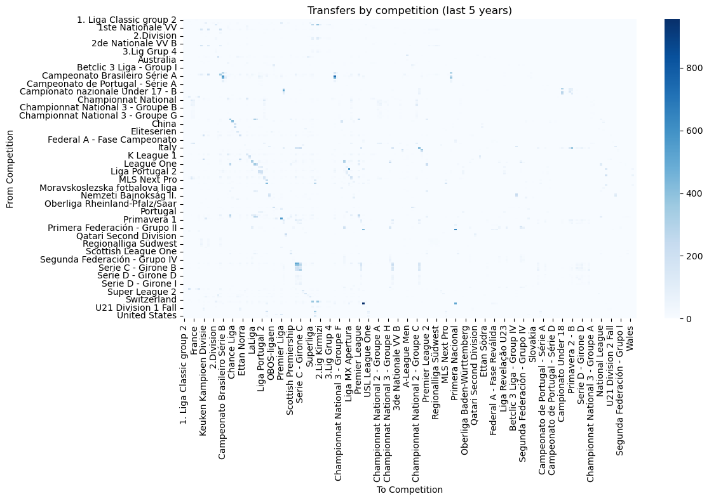
  <br><em>Transfer frequency heatmap – all competitions, last 5 years</em>
</p>

<p align="center">
  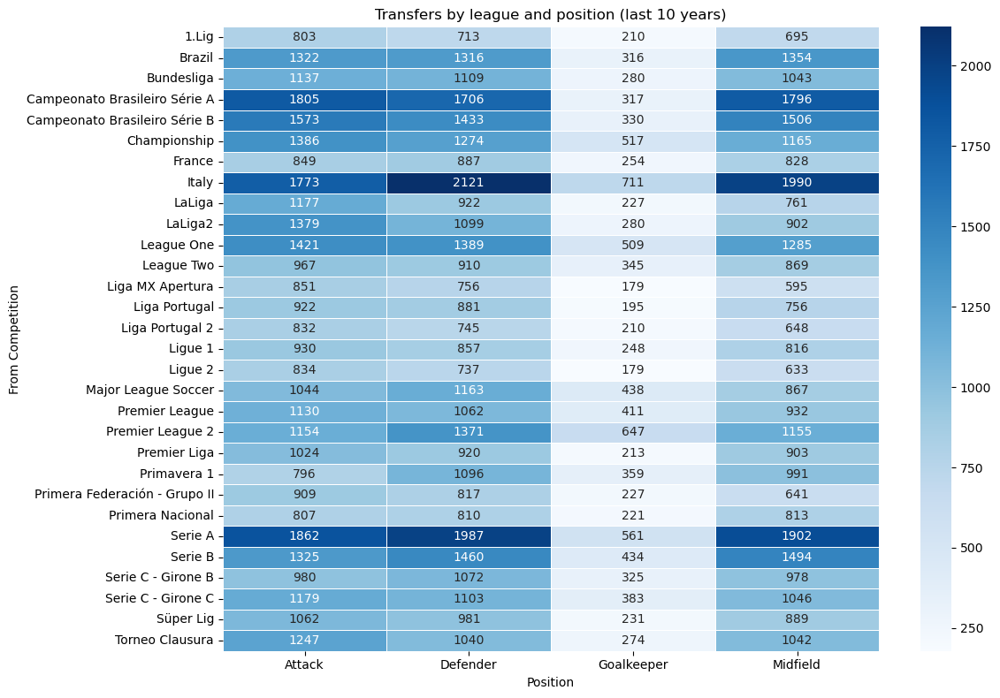
  <br><em>Transfers by league and position – last 10 years</em>
</p>

<p align="center">
  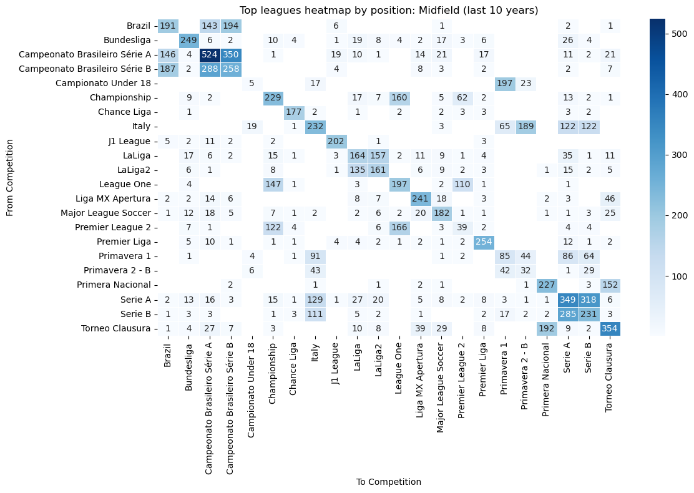
  <br><em>Top 30 leagues transfer heatmap for Midfield players – last 10 years</em>
</p>

> See [`transfer_pattern.ipynb`](transfer_pattern.ipynb)

---

### Q2 — Which agents deal with each club?

Agent–club relationship heatmaps were produced for the Premier League, LaLiga, and all leagues combined (top 30 agent–club paths).

**Key findings:**
- **Wasserman** is the most active agent in the Premier League: Manchester United (985 interactions), Brentford FC (1,148), Aston Villa (405).
- **CAA Stellar** has a strong presence across multiple Premier League clubs.
- **YOU FIRST** leads in LaLiga with 4 deals at Athletic Bilbao.
- Most clubs rely on a small number of well-connected agents, indicating a highly concentrated transfer network.

<p align="center">
  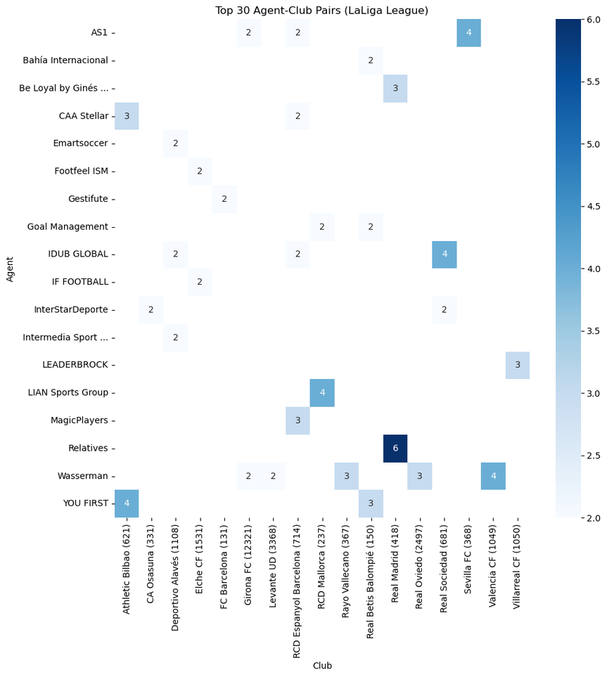
  <br><em>Top 30 agent–club pairs in LaLiga</em>
</p>

> See [`agents_clubs_realtionship.ipynb`](agents_clubs_realtionship.ipynb)

---

### Q3 — What are the two most common citizenships a player holds?

A heatmap of the top 30 dual-citizenship pairs was produced.

**Key findings:**
- **Italy – Argentina** is the most common dual-citizenship pair with **225 players**.
- France – Algeria (156), France – Morocco (158), and England – Ireland (165) follow closely.
- Many pairings reflect historical colonial ties or diaspora patterns (France–North Africa, England–Ireland, Italy–South America).

<p align="center">
  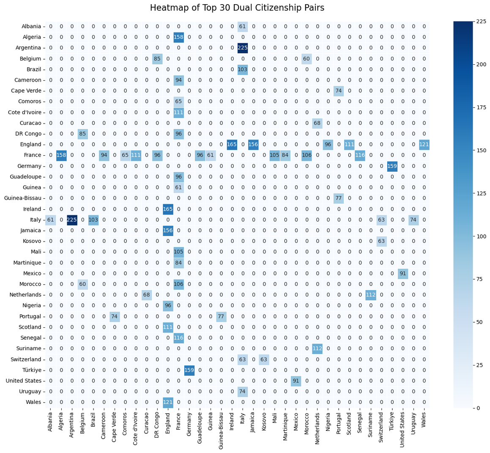
  <br><em>Top 30 dual-citizenship pairs among professional football players</em>
</p>


> See [`citizenshiped_players.ipynb`](citizenshiped_players.ipynb)

---

### Q4 — What are the most common nationality pairs among teammates?

Nationality co-occurrence heatmaps were generated both excluding and including same-country pairs.

**Key findings:**
- Excluding same-country pairs: **Italy–Spain** and **Brazil–Spain** emerge as the most frequent cross-nationality teammate pairs.
- Including all pairs: Italy–Italy (70,000+), Spain–Spain, and Brazil–Brazil dominate, reflecting league composition.
- Cross-national pairings consistently feature countries with large player exports: Brazil, France, England, Germany, and Portugal.

<p align="center">
  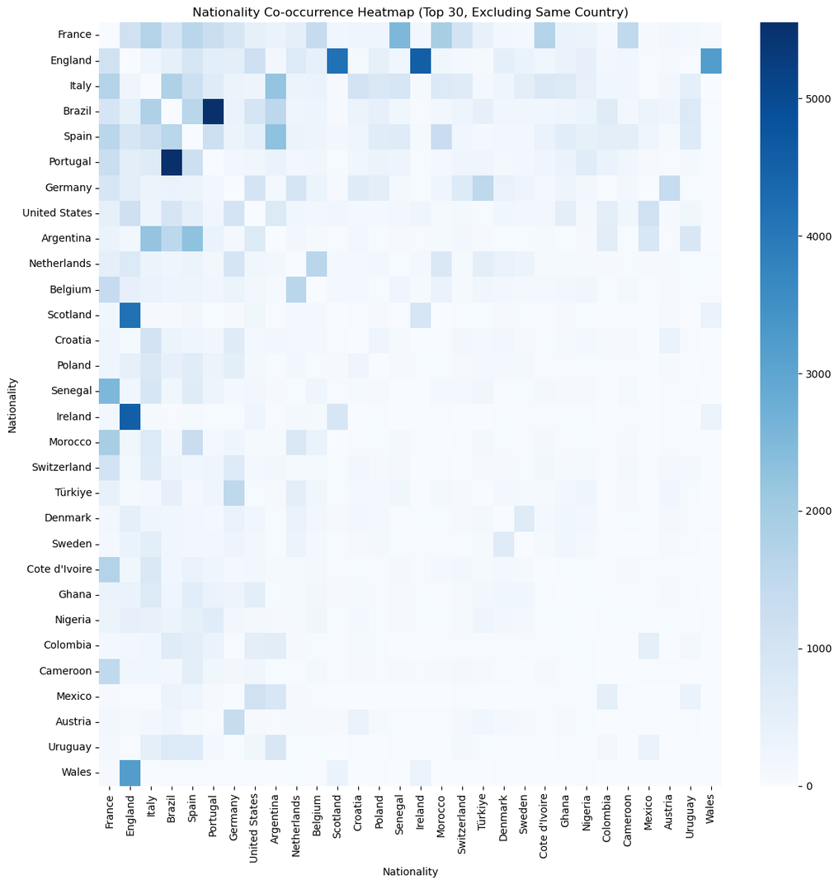
  <br><em>Nationality co-occurrence heatmap (top 30, excluding same-country pairs)</em>
</p>

> See [`nationality_pairs.ipynb`](nationality_pairs.ipynb)

---

## 🤖 Predictive Analysis – Transfer Window Prediction

**Task:** Binary classification — predict whether a player will transfer in the next window.  
**Target:** `1` if the player appeared in the transfer history for the target season, else `0`.

### Feature Engineering

A rolling-window aggregation approach was used to build **30 features** per player–season pair from strictly prior seasons (no data leakage):

| Feature Group | Metrics |
|---------------|---------|
| Performance (last 3 seasons) | goals, assists, minutes_played, yellow_cards, red_cards, penalty_goals, clean_sheets, goals_conceded, subed_in, subed_out, nb_in_group, nb_on_pitch |
| Performance (last 6 seasons) | Same 12 metrics |
| Injury (last 3 & 6 seasons) | days_missed, games_missed |
| National team | international_matches, international_goals |

**Normalization:** StandardScaler (fit on train only). **Split:** 70% train / 20% val / 10% test, stratified.

---

### Model 1 — KNN via PySpark ML (K=3)

sklearn's `KNeighborsClassifier` trained on PySpark-preprocessed features. PySpark handled loading, scaling, and splitting; sklearn handled fitting. RDD repartitioned to 4 partitions for parallel distance computation.

| Split | Accuracy | F1-Score |
|-------|----------|----------|
| Validation | 0.6408 | 0.2406 |
| **Test** | **0.6460** | **0.2410** |

<p align="center">
  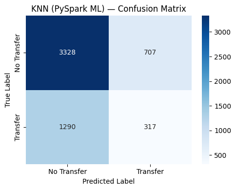
  <br><em>Confusion matrix – KNN (PySpark ML) on test set (5,642 samples)</em>
</p>

 Classification Report:

| Class | Precision | Recall | F1-Score | Support |
|-------|----------:|-------:|---------:|--------:|
| No Transfer | 0.72 | 0.82 | 0.77 | 4035 |
| Transfer | 0.31 | 0.20 | 0.24 | 1607 |
| Accuracy |  |  | 0.65 | 5642 |
| Macro avg | 0.52 | 0.51 | 0.51 | 5642 |
| Weighted avg | 0.60 | 0.65 | 0.62 | 5642 |


The model struggles to detect actual transfers (minority class) due to strong class imbalance (~72% No Transfer vs ~28% Transfer).

---

### Model 2 — KNN MapReduce from Scratch (K=3)

A pure PySpark RDD-based KNN with no external ML library:

- **Map stage:** Each partition computes Euclidean distances and emits local top-K neighbors.
- **Reduce stage:** Partition-local top-K lists are merged and re-sorted globally; final prediction by majority vote.

Due to computational intensity, evaluation was performed on a subset (1,000 train / 200 val / 100 test).

| Split | Accuracy |
|-------|----------|
| Validation | 0.6200 |
| **Test** | **0.6300** |

Performance is broadly consistent with Model 1, confirming the bottleneck is class imbalance rather than implementation choice.

> See [`transfer-window-prediction-model.ipynb`](transfer-window-prediction-model.ipynb)

---

## 🎯 Descriptive Analysis – Player Categorization (K-Means)

### Objective

Cluster **81,256 players** into 5 performance tiers using unsupervised K-Means to identify archetypes useful for scouting and squad planning.

### Features Used

| Feature | What It Captures |
|---------|-----------------|
| `nb_on_pitch_total` | Total appearances |
| `minutes_played_total` | Time on pitch |
| `goals_total` | Club goals scored |
| `assists_total` | Club assists |
| `penalty_goals_total` | Penalty impact |
| `clean_sheets_total` | Defensive reliability |
| `goals_conceded_total` | Defensive pressure |
| `yellow_cards_total` | Discipline |
| `national_matches_total` | International exposure |
| `national_goals_total` | International impact |

### MapReduce Architecture (`kmeans_spark.py`)

The K-Means implementation follows the classic MapReduce paradigm:

- **MAP:** Each player point is assigned to the nearest centroid using Euclidean distance. Centroids are broadcast as read-only variables to all workers.
- **SHUFFLE:** PySpark groups all players by cluster ID via `groupByKey()`.
- **REDUCE:** A new centroid is computed as the mean of all points in each cluster.
- **Initialization:** K-Means++ seeding for improved convergence.
- **Convergence:** Terminates when max centroid shift < `1e-4` or after 20 iterations.

### Results

| Cluster | Label | Count | % |
|---------|-------|-------|---|
| 0 | Elite | 1,605 | 2.0% |
| 1 | Star | 4,284 | 5.3% |
| 2 | Reliable Player | 2,452 | 3.0% |
| 3 | Squad Player | 18,905 | 23.3% |
| 4 | Low Impact | 54,010 | 66.5% |

<p align="center">
  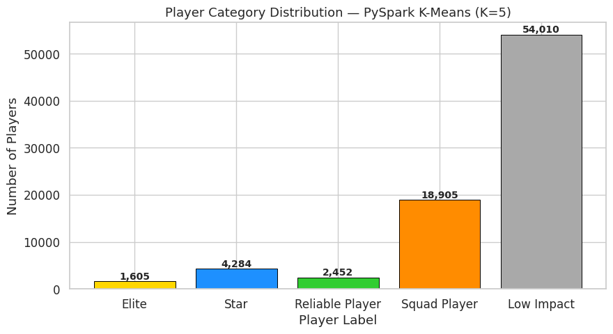
  <br><em>Player category distribution – PySpark K-Means (K=5), 81,256 players</em>
</p>

<p align="center">
  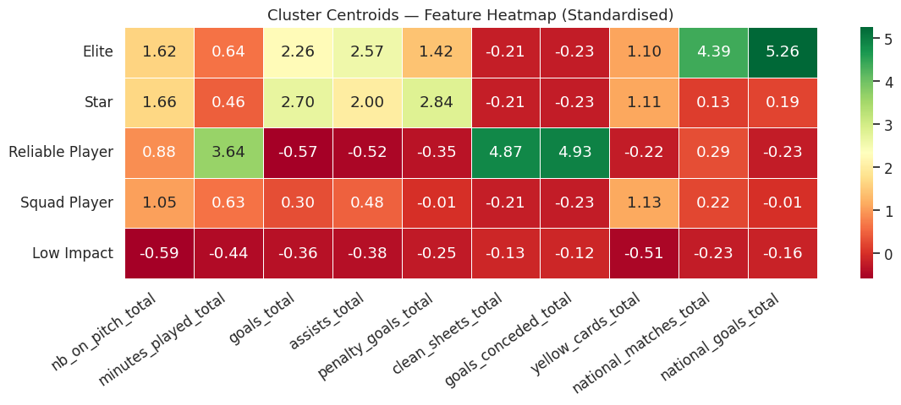
  <br><em>Cluster centroids feature heatmap (standardised) – revealing each archetype's signature</em>
</p>

**Cluster interpretation:**
- **Elite:** Very high international matches (4.39σ) and international goals (5.26σ). The top global talent pool.
- **Star:** High goals, assists, and penalty impact. Strong all-round attackers.
- **Reliable Player:** Extremely high clean_sheets (4.87σ) and goals_conceded (4.93σ). Goalkeepers and elite defenders.
- **Squad Player:** Moderate presence across all features. Solid rotation players.
- **Low Impact:** Below-average across all dimensions. The majority of registered players worldwide.

**Clustering Quality Metrics:**

| Metric | Value |
|--------|-------|
| Silhouette Score | 0.4532 |
| Davies-Bouldin Index | 1.1216 |
| Calinski-Harabasz Index | 30,651.0 |

A Silhouette Score of 0.45 indicates reasonable cluster separation, with some expected overlap between Squad Player and Low Impact given the continuous nature of features.

> See [`player-categorizing-model.ipynb`](player-categorizing-model.ipynb) and [`kmeans_spark.py`](kmeans_spark.py)

---

## 📈 Results Summary

| Component | Method | Key Metric |
|-----------|--------|------------|
| Player Clustering | K-Means MapReduce (PySpark, K=5) | Silhouette = 0.45 |
| Transfer Prediction – Model 1 | KNN (PySpark ML, K=3) | Test Accuracy = 0.646 |
| Transfer Prediction – Model 2 | KNN MapReduce from scratch (K=3) | Test Accuracy = 0.630 |
| Transfer Pattern Analysis | Heatmaps (5 / 10 / 15 years) | Descriptive |
| Agent–Club Analysis | Co-occurrence heatmaps | Descriptive |
| Dual Citizenship Analysis | Co-occurrence heatmaps | Descriptive |
| Nationality Co-occurrence | Heatmaps (with/without same-country) | Descriptive |

---

## 🗂 Repository Structure

```
📦 football-analytics/
├── 📓 EDA.ipynb                            # Full EDA across all tables
├── 📓 transfer_pattern.ipynb               # Transfer frequency heatmaps
├── 📓 agents_clubs_realtionship.ipynb      # Agent–club co-occurrence analysis
├── 📓 citizenshiped_players.ipynb          # Dual citizenship heatmaps
├── 📓 nationality_pairs.ipynb              # Nationality co-occurrence among teammates
├── 📓 player-categorizing-model.ipynb      # K-Means clustering pipeline & results
├── 📓 transfer-window-prediction-model.ipynb  # KNN Models 1 & 2
├── 🐍 kmeans_spark.py                      # Standalone PySpark K-Means MapReduce
└── 📁 readme_assets/                       # Figures and screenshots used in this README
```

### Running the K-Means standalone

```bash
python3 kmeans_spark.py --input data.tsv --k 5 --iters 20
```

Or import and call from a notebook:

```python
from kmeans_spark import run_kmeans
from pyspark.sql import SparkSession

spark = SparkSession.builder.appName("PlayerKMeans").master("local[*]").getOrCreate()
assignments, centroids, history, deltas = run_kmeans(spark, "players.tsv", k=5)
```

---

## 🚀 Future Work

- **Address class imbalance** in transfer prediction using SMOTE oversampling or class-weighted loss. The current ~72/28 split causes poor recall on the Transfer class.
- **Market value regression** using gradient-boosted trees on player-season aligned valuations, once temporal alignment challenges are resolved.
- **Association rule mining** using FP-Growth on grouped league-season transfers to discover statistically significant transfer corridors.
- **Fully distributed deployment** on a multi-machine Spark cluster (AWS EMR / Azure HDInsight) to process the full 5.7M record dataset without subsampling.
- **Graph-based agent network analysis** to uncover communities of agents who operate together across clubs and leagues.

---
